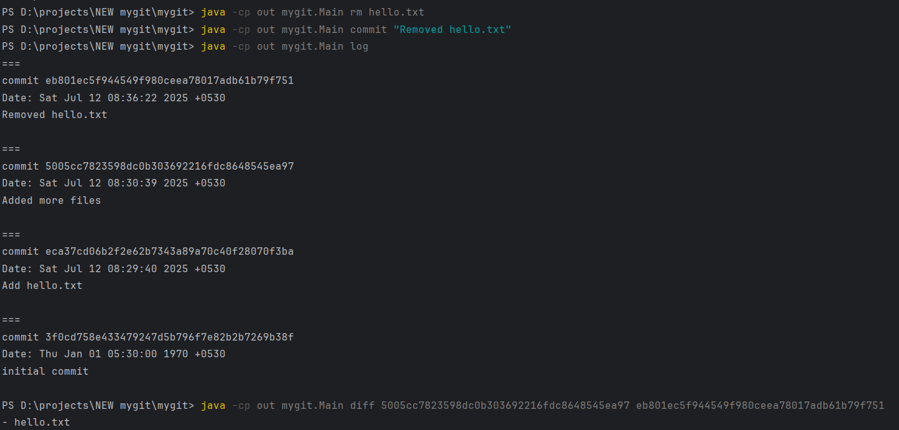

# mygit - A Simple Git-like Version Control CLI

MyGit is a Git-inspired version control system implemented in Java. It provides basic Git functionalities like `add`, `commit`, `status`, `log`, `rm` and `diff`, built to understand how Git works under the hood.

## Features

- `add`: Add files to staging area
- `commit`: Save snapshots with SHA-1 hashing
- `status`: Show current staging info and changes
- `log`: Display commit history in reverse chronological order
- `rm`: Remove files from both the working directory and staging area
- `diff`: Compare working directory with last commit
- SHA-1 based content-addressable storage

## Getting Started

### Screenshots




### CLI commands
```bash
javac -cp src -d out src/mygit/Main.java

java -cp out mygit.Main init

echo "checking staging area part" > hello.txt

java -cp out mygit.Main add hello.txt
# OR add everything
java -cp out mygit.Main add . 

java -cp out mygit.Main status

java -cp out mygit.Main commit "Add hello.txt"

java -cp out mygit.Main log

java -cp out mygit.Main find "Add hello.txt"

java -cp out mygit.Main diff 

java -cp out mygit.Main rm hello.txt

java -cp out mygit.Main commit "Removed hello.txt"

